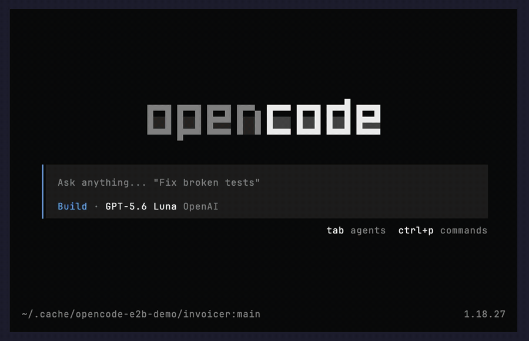

# Warp an OpenCode session into an E2B sandbox (JavaScript)



Your coding agent is running on your laptop, mid-task in a real project. The next step is "install the dependencies and run the test suite" — not something you want on your machine. Type `/warp`, and the **same session — same history — continues inside an E2B sandbox**. The agent does the work there, and when you warp back, **its changes come with the session**: the fix lands in your working tree.

`demo-project/` is the small work-in-progress library the clip runs against (one red test, a `TODO` in the code, an honest README).

This example uses the [OpenCode E2B workspace plugin](https://github.com/e2b-dev/opencode-e2b). It registers an `e2b` workspace type in [OpenCode](https://opencode.ai): each workspace is an E2B sandbox running a remote OpenCode server on a copy of your project. OpenCode itself keeps running locally.

## The core idea

Over OpenCode's HTTP API, the whole flow is five calls:

```ts
// 1. create a workspace → the plugin provisions a sandbox and starts OpenCode in it
const ws = await api('POST', '/experimental/workspace', { type: 'e2b', branch: null })

// 2. a session that starts inside the sandbox
const remote = await api('POST', '/session', {}, { workspace: ws.id })
await prompt(remote.id, { workspace: ws.id })   // "…running on e2b.local"

// 3. or start locally and warp a live session into the sandbox
const local = await api('POST', '/session', {})
await api('POST', '/experimental/workspace/warp', { id: ws.id, sessionID: local.id })
await prompt(local.id, { workspace: ws.id })    // same session, now in the sandbox
```

The sandbox keeps the project at the **same path as on your machine**, so a session's directory is valid on both sides — that is what lets a warped session keep working after it moves.

## How to run

**1. Set your E2B API key**

```bash
cp .env.example .env   # then paste your key from https://e2b.dev/dashboard
```

**2. Log OpenCode into a model provider** (skip if you already use OpenCode)

```bash
opencode auth login
```

Then set `OPENCODE_MODEL=provider/model` in `.env` to pick the model. Store the credential with `opencode auth login` rather than as an environment variable: OpenCode forwards its stored credentials into the sandbox, so the agent keeps working there — an `OPENAI_API_KEY` set only in your shell does not reach the sandbox.

**3. Install and run**

```bash
npm install
npm start          # headless: create workspace → prompt inside → warp a local session → clean up
```

**4. Try it in the TUI**

```bash
npm run tui
```

This opens OpenCode in a fresh copy of `demo-project/`, initialised as its own git repository (pass a path to use your own project instead). Ask about the project, run `/warp` and pick **E2B Sandbox**, then ask the agent to install dependencies and fix the failing test. `/warp` → **None** brings the session back; answer **yes** to "move these changes with the session" and the fix is in your local tree.

## Regenerate the clip

The GIF at the top is rendered from `demo.tape` with [VHS](https://github.com/charmbracelet/vhs) — it drives the real TUI, so it needs the same `.env` and provider login:

```bash
npm run demo
```

## Notes

- Requires OpenCode `1.16.0`+ started with `OPENCODE_EXPERIMENTAL_WORKSPACES=true` (the scripts set it). The workspace API is experimental and can change.
- The first run for a project builds a sandbox template (about one to two minutes). Later workspaces reuse it and connect in about 15 seconds.
- Warping a brand-new session is reliable. Warping a session with a long history can occasionally hit a sync error ("sequence mismatch") — retry, or start the session inside the workspace. See the plugin's [known limitations](https://github.com/e2b-dev/opencode-e2b#known-limitations).
- `npm start` removes its workspace and sandbox at the end. A workspace created in the TUI stays until you remove it or the sandbox pauses after `sandboxTimeoutMs` (1 hour by default).
- When you warp a session out of the sandbox, OpenCode asks whether to move the sandbox's file changes back with it. The diff is what the agent changed there, so **yes** brings the work home.

## Learn more

- [E2B workspaces for OpenCode — docs](https://e2b.dev/docs/agents/opencode/workspace-plugin)
- [Run OpenCode inside a sandbox — docs](https://e2b.dev/docs/agents/opencode) (the other direction)
- [opencode-e2b on GitHub](https://github.com/e2b-dev/opencode-e2b)
