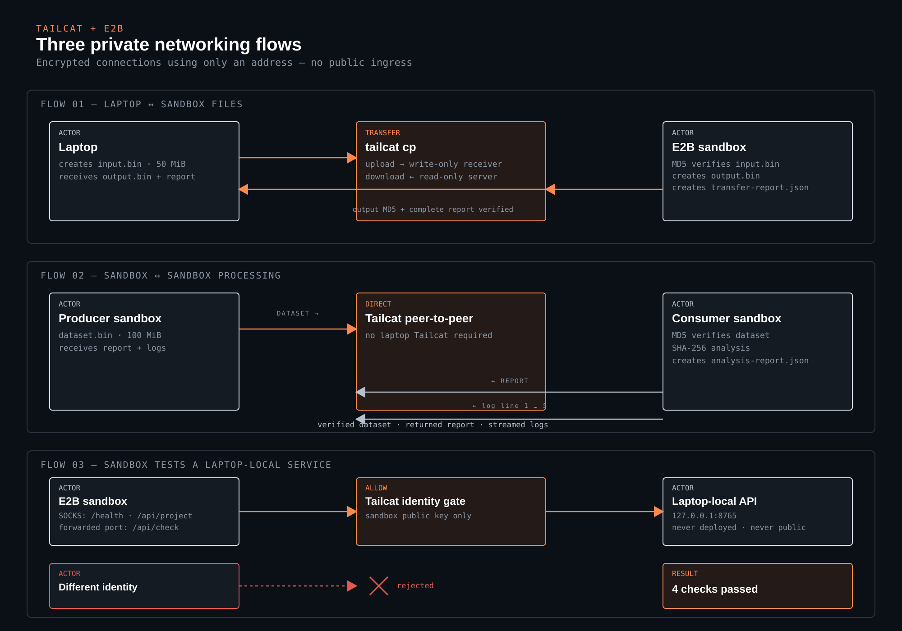

# Tailcat with E2B sandboxes

[Tailcat](https://github.com/tailscale/tailcat) is netcat over Tailscale's data plane: WireGuard encryption and DERP relays, with no control plane, accounts or admin rights. A listener prints an address string, a client uses that string to connect. That fits E2B sandboxes well: a sandbox only needs outbound connectivity, no root, and no kernel network changes.

This example ships a sandbox template with tailcat preinstalled and three demos, in [Python](./python) and [TypeScript](./js):

| Script | What it shows | Needs tailcat on your machine |
| --- | --- | --- |
| `laptop-sandbox-file-transfer` | Transfer a large file in both directions and produce a computed verification report | yes |
| `sandbox-to-sandbox` | A producer sends a dataset to a worker, which returns a JSON analysis report and streams logs | no |
| `sandbox-tests-local-dev-server` | A sandbox tests a development API on your laptop, locked to the sandbox's key | yes |

E2B sandboxes use Tailcat's DERP relay with their stock network configuration. The relay sees encrypted WireGuard packets, not the transferred files, and neither sandbox needs inbound network access. The examples intentionally rely on that simple, dependable path and do not modify sandbox interfaces.




## Setup

Both versions read `E2B_API_KEY` from a `.env` file (copy `.env.template`). `laptop-sandbox-file-transfer` and `sandbox-tests-local-dev-server` also need tailcat on your machine: `brew install tailcat`, or see the [install options](https://github.com/tailscale/tailcat#install).

Build the `tailcat` template once per team, from either language (about one minute):

```bash
cd js && npm install && npm run e2b:build
# or
cd python && poetry install && poetry run build-template
```

If you skip this, the demos create a default sandbox and install tailcat at runtime, which costs a couple of seconds per sandbox.

## Run

```bash
# TypeScript
cd js
npm run laptop-sandbox-file-transfer   # laptop <-> sandbox files
npm run sandbox-to-sandbox              # sandbox <-> sandbox   (also `npm start`)
npm run sandbox-tests-local-dev-server # sandbox tests a laptop-local development API

# Python
cd python
poetry run laptop-sandbox-file-transfer
poetry run sandbox-to-sandbox   # also `poetry run start`
poetry run sandbox-tests-local-dev-server
```

`DEMO_FILE_SIZE_MIB` changes the transferred file size. It defaults to 50 MiB for `laptop-sandbox-file-transfer` and 10 MiB for `sandbox-to-sandbox`. These examples demonstrate the flow rather than benchmark the public relay.

## What happens in each demo

The runnable scripts are 124–155 lines in Python and 151–191 lines in TypeScript. They are deliberately a little longer so the Tailcat commands, checksums, timing and result handling stay visible where they are used. Reusable infrastructure is split by responsibility: `e2bSandbox` adapts the E2B SDK, while `tailcatServer` owns listener processes and address readiness.

### Laptop and sandbox exchange files

```text
create a temporary 50 MiB file on the laptop
create a sandbox and start its write-only receiver
copy input.bin from laptop to sandbox
compare the local and sandbox MD5 hashes; stop on a mismatch
have the sandbox create output.bin and a report containing real sizes and hashes
start a read-only file server in the sandbox
list and download the results to the laptop
verify output.bin and the complete report; always stop the listener and sandbox
```

This is the most familiar file-transfer example. It showcases visible end products on the laptop: `output.bin` and `transfer-report.json`.

### Two sandboxes exchange a dataset and a result

```text
create a producer sandbox and a consumer sandbox
have the producer create and serve dataset.bin
give only the producer's Tailcat address to the consumer
copy 10 MiB through DERP and verify its MD5 at both ends
have the consumer calculate a SHA-256 analysis report
copy analysis-report.json back to the producer
stream five log lines through a separate one-shot connection
always stop both listeners and both sandboxes
```

This is the strongest networking showcase: no laptop Tailcat installation is needed, and the output makes both directions of communication obvious.

### A sandbox tests a laptop-local development server

```text
start an HTTP server bound only to the laptop's loopback interface
create a sandbox and generate a Tailcat client key inside it
serve the local HTTP port, allowing only that sandbox key
call /health and /api/project through Tailcat's SOCKS proxy
map the same connection to a sandbox-local TCP port and call /api/check
try a different identity and prove that it is rejected
always stop Tailcat, the sandbox and the local HTTP server
```

This is the most practical agent-development example: code running remotely can test a service that has not been deployed or exposed publicly.

## Named callbacks

- `handleLocalHttpRequest` / `LocalRequestHandler.do_GET` handles the three HTTP routes used by the local-service demo.
- `readAddressFile` and `readServerLog` are passed to `waitForTailcatAddress`; the helper calls them while waiting for a listener to become ready.
- Every started listener returns a named `stop` callback. Each demo calls it from `finally`, so a failed checksum or request does not leave a process running.
- The Python SDK's background stderr callback was unreliable during the spike, so neither implementation depends on it. Both poll Tailcat's documented `TAILCAT_ADDR_FILE` instead.

## How it fits together

```
js/                                   python/
├── template/template.ts              ├── tailcat_e2b/template.py          the sandbox template
├── template/build.ts                 ├── tailcat_e2b/build_template.py    Template.build(alias="tailcat")
├── src/e2bSandbox.ts                  ├── tailcat_e2b/e2b_sandbox.py       E2B lifecycle + command adapter
├── src/tailcatServer.ts               ├── tailcat_e2b/tailcat_server.py    listener lifecycle + readiness
├── src/laptopSandboxFileTransfer.ts  ├── tailcat_e2b/laptop_sandbox_file_transfer.py
├── src/sandboxToSandbox.ts           ├── tailcat_e2b/sandbox_to_sandbox.py
└── src/sandboxTestsLocalDevServer.ts └── tailcat_e2b/sandbox_tests_local_dev_server.py
```

- The **template** installs tailcat from the GitHub release, plus `openssh-client` (tailcat drives the system scp and ssh), `socat` for local port forwarding, and Python for formatting the generated JSON report.
- **e2bSandbox** creates the sandbox and turns E2B command results into a small, consistent shape.
- **tailcatServer** starts a listener in a sandbox or on the laptop, reads its address and waits until it answers through DERP.
- Each **script** keeps its Tailcat client commands, checksums, timing and result handling beside the flow they explain. The two languages follow the same steps without forcing line-for-line parity.

## Quirks you need to know about

Two Tailcat details are worth handling explicitly.

### 1. tailcat prints its address before it is reachable

The address appears on stderr as soon as the key exists, but the listener needs another one to three seconds to connect to the DERP relay. A client that connects in that window logs `derp-303 does not know about peer` and its 10 s deadline expires. `waitUntilReachable` / `wait_until_reachable` pings with a 3 s timeout until the listener answers. The same applies to `tailcat cp` and `tailcat ssh`, which do an internal ping first.

### 2. Reading the address from the SDK

Background commands in the Python SDK did not deliver stderr callbacks reliably in this setup, and polling a file is the same code in both languages. tailcat offers two clean alternatives: `TAILCAT_ADDR_FILE=/path` writes the address to a file, and `--json` prints `{"listenAddr": ...}` on stdout. The helper uses the file.

## What tailcat gives you here

- **Encrypted transfers that bypass the E2B API.** Files or directories move over WireGuard through DERP, with `cp`, `ls` and `recv` semantics and no public URL.
- **Sandbox to sandbox networking.** E2B does not route between sandboxes. Two sandboxes that hold each other's tailcat address can exchange encrypted traffic through the relay.
- **Test a local development server from a sandbox.** With `tailcat serve --allow=<sandbox key> <port>` on the laptop, an agent or test runner in the sandbox can exercise your local app before it is deployed, and only that sandbox can connect.
- **Shell access.** `tailcat serve no-auth-ssh` in the sandbox and `tailcat ssh <addr>` from anywhere, no key setup.

## Limits

- These demos intentionally use the public DERP relays at `tailcat.dev` for sandbox traffic. They are free, rate limited and have no SLA.
- tailcat has no API, CLI or wire-format stability guarantees yet.
- `no-auth-ssh` is what it says. Pair it with `--allow` or keep it to throwaway sandboxes.
- If a sandbox has a network allowlist, it needs the DERP hosts from https://tailcat.dev/derpmap.json on TCP 443 and UDP 3478.
